# LifeExpectancyAnalysis
### Data Analysis and Visualtization

# Introduction to dataset

There are several factors that affect the life expectancy of a country like demographic variables, income composition, mortality rates, immunization and schooling among others. It is important to determine which factors are positively and negatively affecting the life expectancy. For further analysis, the team decided to consider the dataset of 193 countries for the period 2000 to 2015 collected from the WHO data repository. The dataset consists of 22 columns and 2938 rows.

# Hypothesis

The primary focus was to determine how immunization affects the life expectancy. The first hypothesis was that if people receive more vaccination for hepatitis B, diphtheria and polio, their life expectancy will increase. The second hypothesis was, if adult mortality, infant deaths and under five deaths are decreased, life expectancy will increase. The third hypothesis was, if factors like percentage expenditure and total expenditure on health, GDP and income composition of resources increases, life expectancy will increase. The fourth hypothesis was that there is no effect of schooling on life expectancy.

# Definition of terms

The dataset consists of 22 columns and 2938 rows. Each row represents a country&#39;s data for a particular year. There were missing values for columns: life expectancy, adult mortality, alcohol, hepatitis B, BMI, polio, total expenditure, diphtheria, GDP, population, thinness 1-19 years, thinness 5-9 years, income composition of resources and schooling.

 The abbreviated names and their corresponding definitions of columns are as follows:

- Country- It represents the names of the countries. Its data type is Factor.
- Year- It represents the Year. Its data type is integer.
- Status- It represents the status of the country- Developed or Developing. Its data type is Factor.

- Life Expectancy- It represents the age of a person. Its data type is numeric.
- Adult Mortality- It represents the probability of dying for males and females between 15 and 60 years per 1000 population. Its data type is an integer.
- Infants deaths- Number of infant deaths per 1000 population. Its data type is integer.

- Alcohol- It represents the alcohol consumption per capita for a person older than 15 years. It is measured in liters. Its data type is numeric.
- Percentage expenditure- It represents expenditure on health as a percentage of Gross Domestic Product per capita. It&#39;s measured in percentage. Its data type is numeric.
- Hepatitis B- It represents the immunization coverage for 1 -year- old. It&#39;s measured in percentage. Its data type is integer.
- BMI - It represents the average body mass index of the entire population. Its data type is numeric.
- Under-five deaths- Number of under 5 deaths per 1000 population. Its data type is an integer.
- Polio- It represents polio immunization coverage among 1 year old. Its data type is an integer.
- Total expenditure- It represents the general government expenditure on health as a percentage of total government expenditure. It&#39;s measured in percentage. Its data type is numeric.
- Diphtheria- It represents the immunization coverage for infants. Its data type is integer. It&#39;s measured in percentage.
- HIV- It represents deaths per thousand people in the span of 0-4 years. Its data type is numeric.
- GDP- It represents the gross domestic product in USD. It shows how an increase in life expectancy is accompanied by an increase in GDP per capita income. Its data type is numeric.
- Population- It represents the population of a country. Its data type is numeric. It&#39;s measured in billions.
- Thinness 1-19 years- It represents the thinness among children and adolescents for age 10-19 years. Its data type is numeric. It&#39;s measured in percentage.
- Thinness 5-9 years- It represents the thinness among children for age 5-9 years. Its data type is numeric. It&#39;s measured in percentage.
- Income composition of resources- It represents the income share of a population group or area relative to the aggregate total income of that group or area. This income composition will help in knowing the Human Development Index of a country which ranges from 0 to 1 where 0 represents a country with a lower lifespan and 1 represents a country with a higher lifespan. Its data type is numeric.
- Schooling- It represents the number of years of schooling. This column explains how education affects life expectancy. Its data type is numeric. It is represented in years.

# **Summary Data**

The summary of the dataset showed missing values for life expectancy, adult mortality, alcohol, hepatitis B, BMI, polio, total expenditure, diphtheria, GDP, population, thinness 1-19 years, thinness 5-19 years, income composition of resources, schooling. The data was summarized for 512 developed countries and 2426 developing countries. The missing values could create inconsistency in the data and may lead to false results. Replacing the missing values with mean could change the data, so the team decided to remove them from these columns. The dataset then turned out to be 22 columns and 1649 rows, summarizing for 242 developed countries and 1407 developing countries. The numerical summary for the dataset can be found in [appendix](#_Appendix).

The summary of the life expectancy data after removing the missing values showed some abnormality. The percentage expenditure was more than 100 for some countries which is not appropriate. The maximum value for infant deaths was 1600 and was 2100 for under five deaths per 1000 population. The data for these columns showed abnormality as any value greater than 1000 is possible, only if the data was collected per 1000 families as there can be multiple infant deaths and under five deaths per family. The maximum years of schooling in the summary is 20 years. Even though 10-15 years of schooling was abundant, there might be cases when a student pursues a medical degree or other similar kind of degree. The life expectancy ranges from 44 to 89.0 years with an average life span of 69.3 years. At a minimum, 2% of the infants got vaccinated for hepatitis B and diphtheria and there were countries where 99% of the infants receive immunization for hepatitis B and diphtheria. The average BMI ranged from 2 to 77.10. The minimum thinness among 5- 9 years old was 0.10 and maximum thinness was 28.20. After careful examination of the summary, the team decided to remove under five deaths, infant deaths and percentage expenditure as they showed abnormality in the data. The team then decided to plot histograms for visualizing each column and detecting the underlined pattern. Scatter plots were used for visualizing the relationship between life expectancy and other factors.

# Visualization

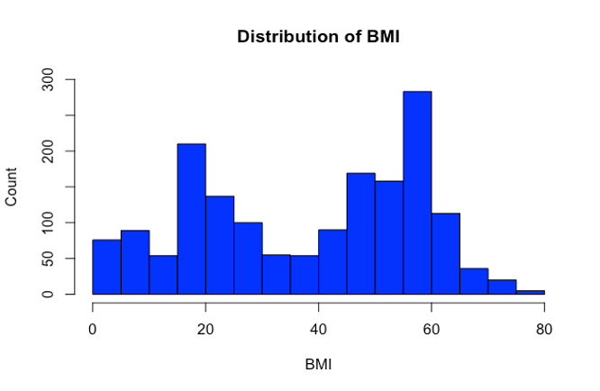

The data for BMI is split into two groups: one group ranging from 0-40 and other ranging from 40-80. There is no other column in dataset except status that is divided into two categories. So, it is possible that BMI is divided into 2 groups based on the status of the country i.e. developed and developing.

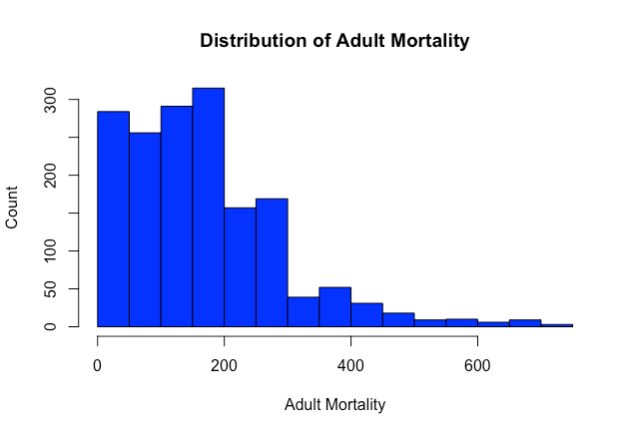

Histogram appears to be right skewed. Most of the data is concentrated on left indicating less adult mortality.

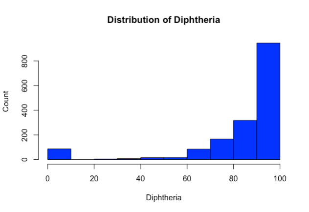

Histogram appears to be left skewed. Most of the data is concentrated on right indicating more immunization was received by 1 year old for diphtheria.

## **Visualization of factors affecting the life expectancy:**

For visualization using scatterplots, the team used the &quot;group by&quot; function on countries and calculated the mean to make visualization clearer for all the variables. &quot;Plot&quot; function was used to plot these variables against life expectancy.

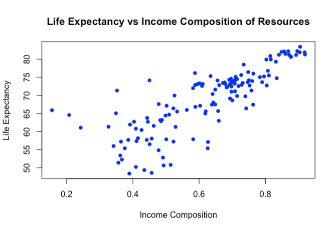

The graph shows that as the income composition increases, life expectancy increases. It shows a positive relationship.

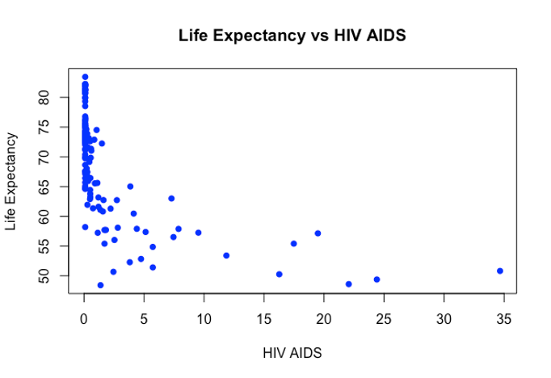

As people are more affected with HIV AIDS, life expectancy decreases. It shows an inverse relationship with life expectancy.

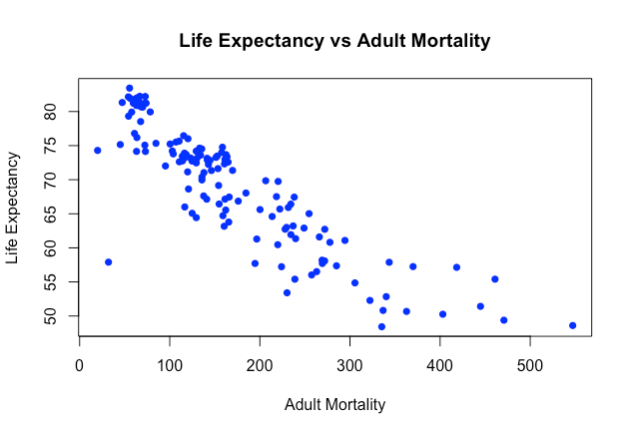

As adult mortality increases, life expectancy decreases. It shows inverse relationship.

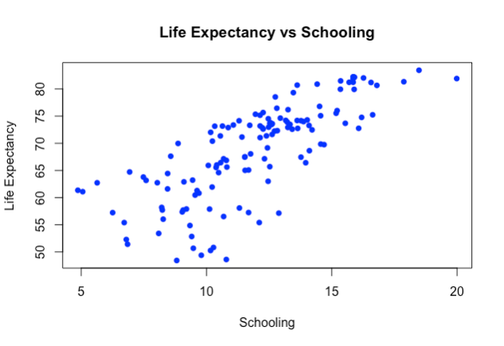

With increase in number of years of schooling there is an increase in life expectancy, there is a positive correlation between them.

## **Comparison of adult mortality, infant deaths and under five deaths between developed and developing countries:**

The team was interested in knowing which countries have highest and lowest values of adult mortality rate, infant deaths and under 5 deaths as well as the status (developing or developed) of these countries. For this analysis, the top 5 minimum and maximum life expectancy values were determined. Based on that, the corresponding values for under five deaths, infant deaths and adult mortality was found. Below graphs shows the comparison.

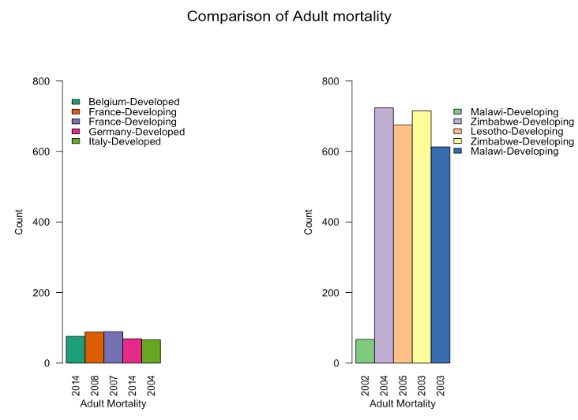

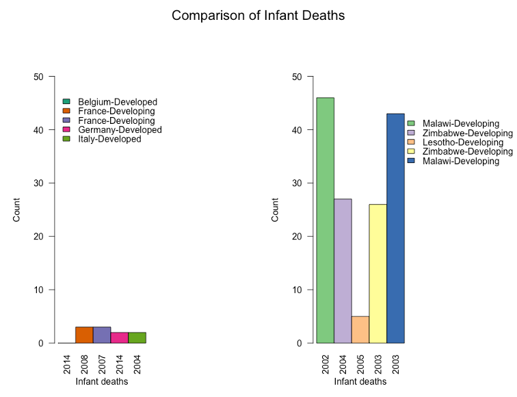

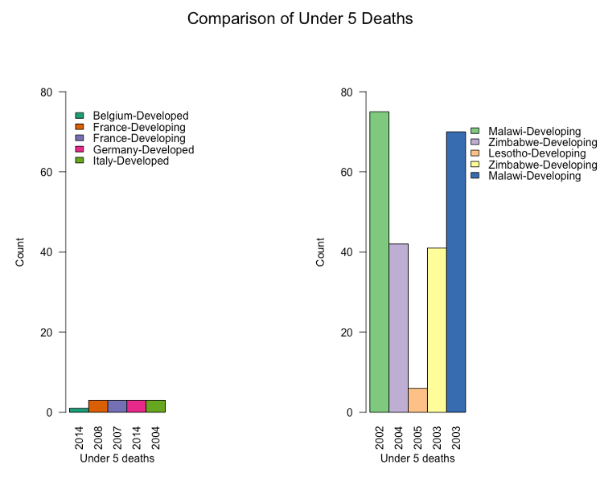

These graphs indicate that the adult mortality, infant deaths and under five deaths have low values in developed countries (although France seems to be outlier), whereas these values are high in developing countries.

Furthermore, Belgium, France, Germany and Italy are European countries whereas Malawi, Zimbabwe, Lesotho are African countries. It is possible that values are higher for African countries than European countries because of difference in years. To summarize, it can be said that African countries probably have less vaccinated children and so these countries should be given more attention to improve life expectancy of its population.

# Multicollinearity

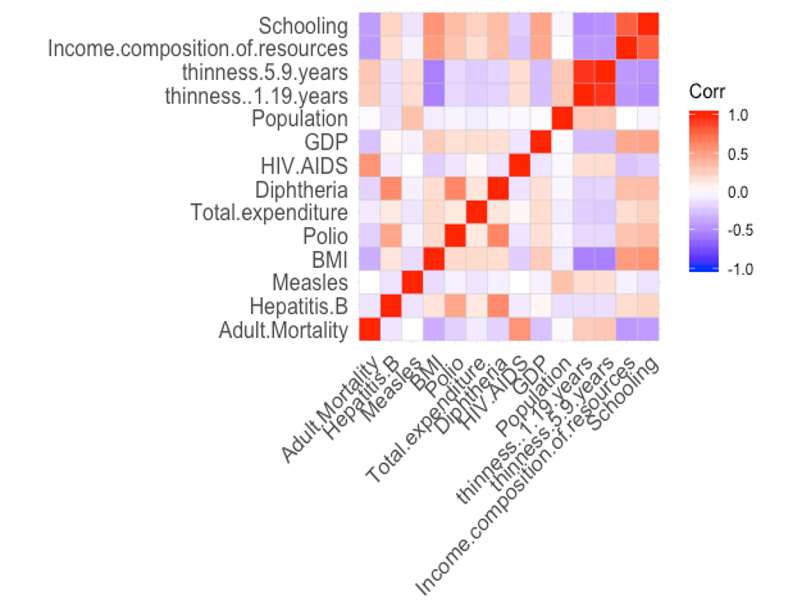

From the graph, it can be seen that there is a high correlation between schooling and income composition of resources, thinness 5-9 years and thinness 1-19 years. Hence, the model was tested by removing the columns (thinness 1-19, thinness 5-9, income composition of resources and schooling) one by one and checking for R square and standard error. The model was built by removing only thinness 1-19 years, as the R square was decreased, and standard error was increased by removing schooling and income composition of resources.

# Regression

The regression was performed on the adult mortality, hepatitis B, measles, BMI, Polio, Total expenditure, diphtheria, HIV AIDS, GDP, Population, thinness 5-9 years, income composition of resources and schooling. The summary showed some insignificant x variables in the model. The final model was built by removing the insignificant variables step by step by and checking P values (\&lt;=0.05). There was no significant difference seen in the R square and standard error before and after removing the insignificant x variables.

# Predictions on Training and Testing Dataset

The data was divided into two sets: training and testing. The training data contained 1300 rows and testing data contained 349 rows. The model was built on the training data and the predictions were done on testing as well as training data. The RMSE was calculated on testing predictions and the value turned out to be 3.6352. On comparing this value with the standard error (3.709) of the final model built after removing the insignificant x variables, the model fits well when applied to the new data (testing data).

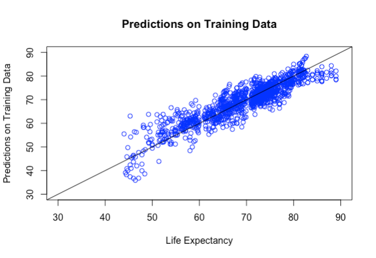

![](docs/13_Predictions_on_testing_data.png

# Hypothesis Results

Some of the hypothesis were proven false when the standard deviation of all the significant x variables was multiplied with the coefficients of x variables, to check how typical change in each x variable affected the y variable. The adult mortality, thinness 5-9 years and HIV AIDS were negatively correlated with life expectancy. The factors such as BMI, immunization for diphtheria, GDP, income composition of resources and schooling were positively related with life expectancy. Surprisingly, schooling turned out to be the most significant factor that affects the life expectancy.

#

# Residual diagnostics

Residual diagnostics was performed to check whether the regression assumptions are satisfied and to spot the problems with the fit. Residuals are plotted on a histogram to check for the normal distribution of the errors.

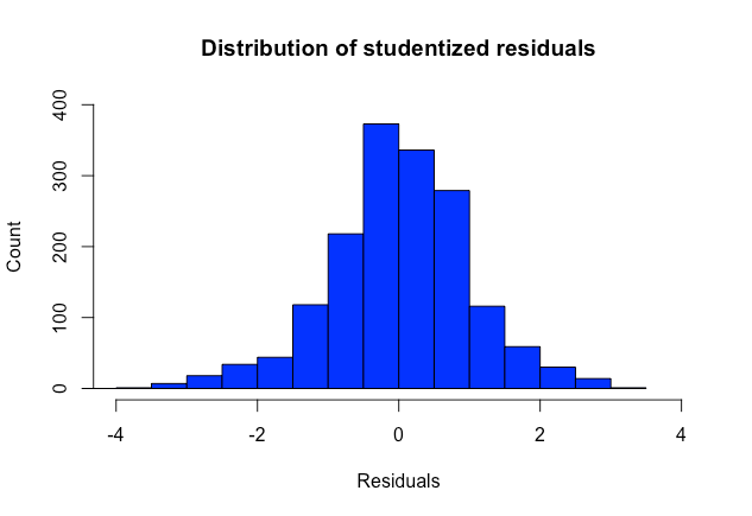

The graphs showed that the errors were roughly normally distributed.

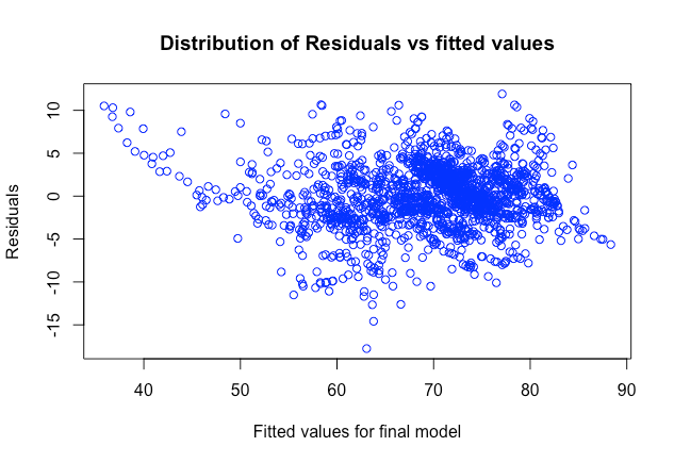

On plotting the residuals vs fitted values, random pattern was seen.

The graphs were plotted for residuals against each x variable to check for the non-constant variance. From all the graphs, diphtheria and GDP plotted against residuals showed V pattern indicating the presence of non-constant variance.

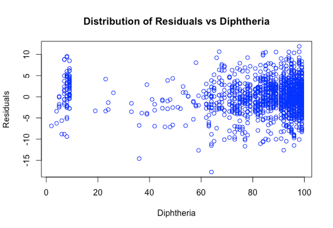

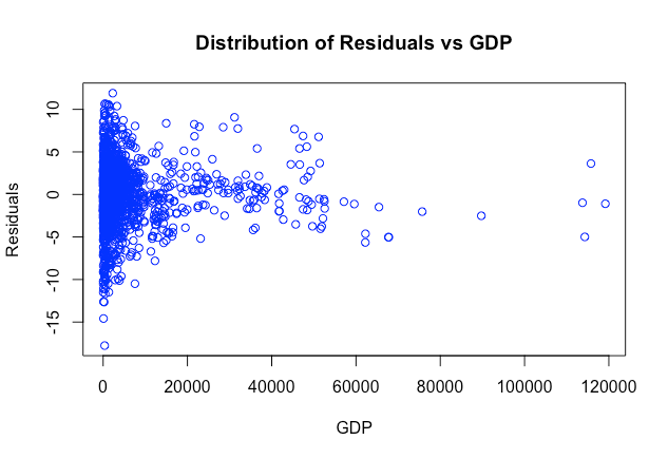

To fix the non-constant variance, the model was built by taking the square root and log of the y variable (life expectancy). The R square deteriorated, and the standard error increased when the model was built by taking the square root of the y variable. So, the final model was built by taking the log of the y variable. The summary of this model showed a drastic change in the standard error which was reduced from 3.709 to 0.1341.

# Conclusion

Before analyzing this dataset, the team was under the impression that life expectancy can be increased if one has more money. This was because one needs money to be healthy and to get appropriate medical treatment. Also, if a country is economically developed, all of its citizens can afford proper medical treatment. This would mean that the life expectancy is broadly dependent on economic factors. However, after performing the analysis on this dataset, the team concluded that the life expectancy is majorly affected by the education. This makes sense because if the person is educated enough to recognize the health issues, he/she can make the appropriate changes in their lifestyle including but not limited to diet and exercising which would ideally extend their life expectancy. Education can change the perception of an individual and can help them understand the benefits of being fit and how it affects their health. Also, higher education might be co-related to higher income and higher income would mean higher spending on health and fitness. Thus, education is directly or indirectly a good predictor of the life expectancy.